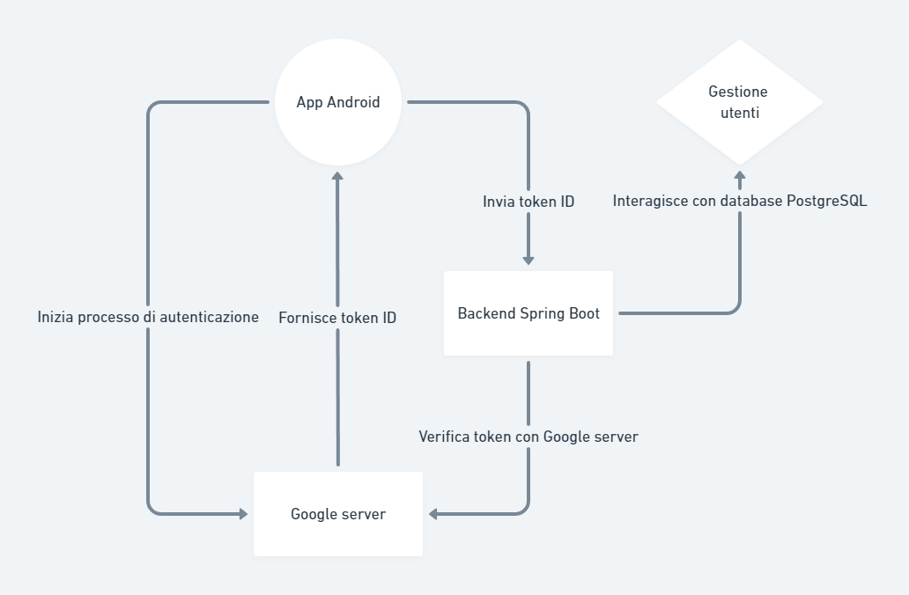

# Guida per l'Autenticazione Google con Android, Spring Boot e PostgreSQL

## Prerequisiti

1. **Google Cloud Console**:
   - Un progetto su Google Cloud Console.
   - Abilita l'API di Google Sign-In.
   - Configura lo schermo di consenso OAuth.
   - Crea credenziali OAuth 2.0 e ottieni il `webClientId`.

2. **Spring Boot Backend**:
   - Un'applicazione Spring Boot configurata.
   - Un database PostgreSQL configurato.

3. **Android App**:
   - Android Studio installato.
   - Un progetto Android configurato.

## Passaggi

### 1. Configurare Google Cloud Console

1. Accedi a [Google Cloud Console](https://console.cloud.google.com/).
2. Crea un nuovo progetto o selezionane uno esistente.
3. Vai su **API & Services > OAuth consent screen** e configura le informazioni richieste.
4. Vai su **API & Services > Credentials** e crea credenziali OAuth 2.0. Ottieni il `webClientId`.

### 2. Configurare il Backend Spring Boot

1. Aggiungi le dipendenze necessarie nel file `pom.xml`:

    ```xml
    <dependency>
        <groupId>org.springframework.boot</groupId>
        <artifactId>spring-boot-starter-security</artifactId>
    </dependency>
    <dependency>
        <groupId>org.springframework.security.oauth.boot</groupId>
        <artifactId>spring-security-oauth2-autoconfigure</artifactId>
        <version>2.1.6.RELEASE</version>
    </dependency>
    <dependency>
        <groupId>org.postgresql</groupId>
        <artifactId>postgresql</artifactId>
        <scope>runtime</scope>
    </dependency>
    ```

2. Configura il database PostgreSQL nel file `application.properties`:

    ```properties
    spring.datasource.url=jdbc:postgresql://localhost:5432/your_db
    spring.datasource.username=your_username
    spring.datasource.password=your_password
    spring.jpa.hibernate.ddl-auto=update
    ```

3. Configura la sicurezza per supportare l'autenticazione Google:

    ```java
    @Configuration
    @EnableWebSecurity
    public class SecurityConfig extends WebSecurityConfigurerAdapter {
        @Override
        protected void configure(HttpSecurity http) throws Exception {
            http
                .authorizeRequests(a -> a
                    .antMatchers("/", "/error", "/webjars/**").permitAll()
                    .anyRequest().authenticated()
                )
                .oauth2Login();
        }
    }
    ```

4. Implementa un controller per gestire la richiesta di autenticazione:

    ```java
    @RestController
    public class AuthController {
        @GetMapping("/user")
        public Principal user(Principal principal) {
            return principal;
        }
    }
    ```

### 3. Configurare l'App Android

1. Aggiungi le dipendenze necessarie nel file `build.gradle`:

    ```groovy
    implementation 'com.google.android.gms:play-services-auth:20.2.0'
    implementation 'androidx.credentials:credentials:1.5.0-alpha02'
    ```

2. Configura il file `res/values/strings.xml` con il `webClientId`:

    ```xml
    <string name="web_client_id">your_web_client_id</string>
    ```

3. Implementa l'autenticazione Google nella tua app Android:

    ```kotlin
    package com.example.frontend.model

    import android.content.ContentValues.TAG
    import android.content.Context
    import android.util.Log
    import androidx.credentials.*
    import com.example.frontend.R
    import com.google.android.libraries.identity.googleid.*
    import kotlin.random.Random

    class GoogleAuthentication(private val context: Context) {

        private lateinit var request: GetCredentialRequest
        private val webClientId = context.getString(R.string.web_client_id)
        private val credentialManager = CredentialManager.create(context)

        private fun getNonce(): String {
            val nonceLength = 32
            val nonceBytes = ByteArray(nonceLength)
            Random.nextBytes(nonceBytes)
            return nonceBytes.joinToString("") { "%02X".format(it) }
        }

        private fun getGoogleIdOption(): GetGoogleIdOption {
            return GetGoogleIdOption.Builder()
                .setServerClientId(webClientId)
                .setAutoSelectEnabled(true)
                .setNonce(getNonce())
                .build()
        }

        private fun getSignInGoogleOption(): GetSignInWithGoogleOption {
            return GetSignInWithGoogleOption.Builder(webClientId)
                .setNonce(getNonce())
                .build()
        }

        private fun createRequest(button: Boolean): GetCredentialRequest {
            return if (button) {
                GetCredentialRequest.Builder().addCredentialOption(getGoogleIdOption()).build()
            } else {
                GetCredentialRequest.Builder().addCredentialOption(getSignInGoogleOption()).build()
            }
        }

        suspend fun signIn(button: Boolean) {
            Log.d(TAG, "Initiating sign-in flow" + if (button) " with GoogleIdOption" else " with SignInWithGoogleOption")
            request = createRequest(button)
            try {
                val result = credentialManager.getCredential(
                    context = context,
                    request = request,
                )
                handleSignIn(result)
            } catch (e: GetCredentialException) {
                handleFailure(e)
            }
        }

        private fun handleSignIn(result: GetCredentialResponse) {
            Log.d(TAG, "Sign-in flow completed")
            when (val credential = result.credential) {
                is PublicKeyCredential -> {
                    val responseJson = credential.authenticationResponseJson
                }
                is PasswordCredential -> {
                    val username = credential.id
                    val password = credential.password
                }
                is CustomCredential -> {
                    if (credential.type == GoogleIdTokenCredential.TYPE_GOOGLE_ID_TOKEN_CREDENTIAL) {
                        try {
                            val googleIdTokenCredential = GoogleIdTokenCredential.createFrom(credential.data)
                        } catch (e: GoogleIdTokenParsingException) {
                            Log.e(TAG, "Received an invalid google id token response", e)
                        }
                    } else {
                        Log.e(TAG, "Unexpected type of credential")
                    }
                }
                else -> {
                    Log.e(TAG, "Unexpected type of credential")
                }
            }
        }

        private fun handleFailure(e: GetCredentialException) {
            Log.i(TAG, "WebClientId: $webClientId")
            Log.i(TAG, "Origin request: ${request.origin}")
            Log.i(TAG, "Credential options request: ${request.credentialOptions}")
            Log.e(TAG, "Error getting credential", e)
        }
    }
    ```

4. Modifica `AndroidManifest.xml` per aggiungere l'autorizzazione per Internet:

    ```xml
    <uses-permission android:name="android.permission.INTERNET"/>
    ```

### 4. Integrare il Backend e l'App Android

1. Quando l'utente effettua il login tramite Google, ottieni il token ID di Google.
2. Invia il token ID di Google al backend Spring Boot.
3. Verifica il token ID nel backend utilizzando le librerie OAuth di Google.
4. Una volta verificato il token, crea una sessione utente nel tuo sistema e restituisci un token di sessione alla tua app Android.
5. Utilizza il token di sessione per autenticare le richieste successive dell'utente.

Ecco un esempio di verifica del token nel backend:

```java
import com.google.api.client.googleapis.auth.oauth2.GoogleIdToken;
import com.google.api.client.googleapis.auth.oauth2.GoogleIdTokenVerifier;
import com.google.api.client.http.javanet.NetHttpTransport;
import com.google.api.client.json.jackson2.JacksonFactory;

import java.io.IOException;
import java.security.GeneralSecurityException;
import java.util.Collections;

public class GoogleTokenVerifier {

    private static final String CLIENT_ID = "your_web_client_id";

    public GoogleIdToken verifyToken(String idTokenString) throws GeneralSecurityException, IOException {
        GoogleIdTokenVerifier verifier = new GoogleIdTokenVerifier.Builder(new NetHttpTransport(), new JacksonFactory())
                .setAudience(Collections.singletonList(CLIENT_ID))
                .build();

        return verifier.verify(idTokenString);
    }
}
```

## Schema di Autenticazione


